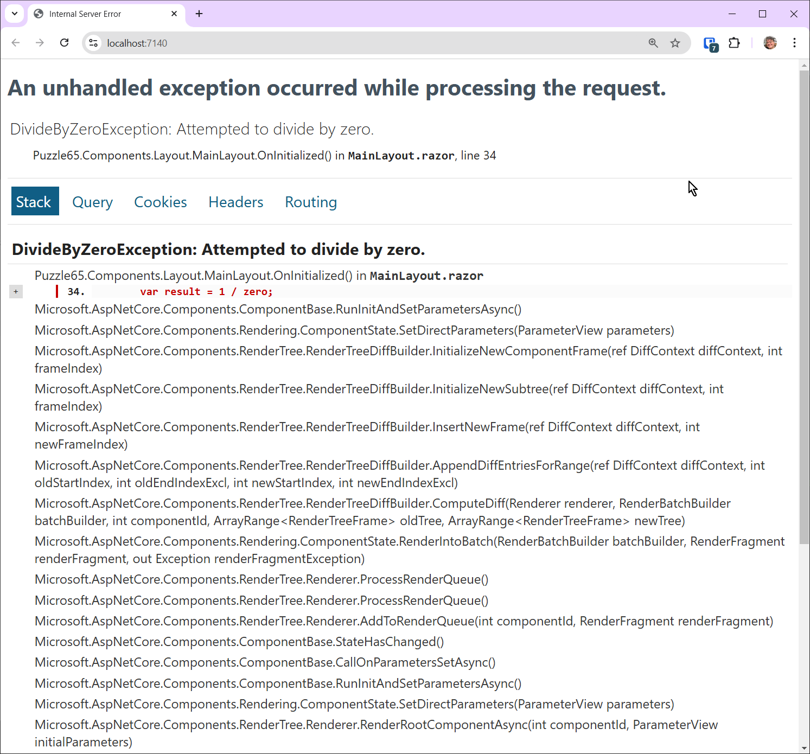

# Blazor Puzzle #65

## Exception Impossible!

YouTube Video: https://youtu.be/gXgxhD5VHnE

Blazor Puzzle Home Page: https://blazorpuzzle.com

### The Challenge:

This is a .NET 9 Blazor Web App with Global Server Interactivity

We are purposely introducing a bug in *MainLayout.razor* to present a challenge:

```c#
@code
{
    protected override void OnInitialized()
    {
        int zero = 0;
        var result = 1 / zero;
    }
}
```

When you run the app, it will crash:



The exception will not be caught by the UI error handler.

Without using a try/catch, how can you gracefully tell the user that there was an error?

