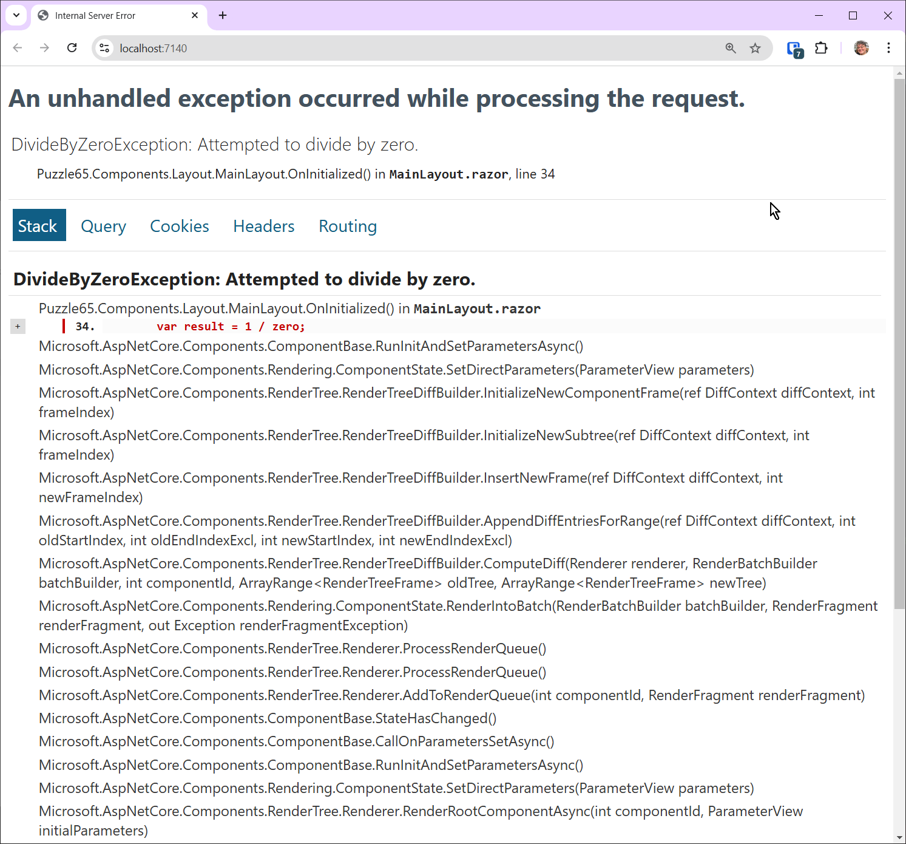
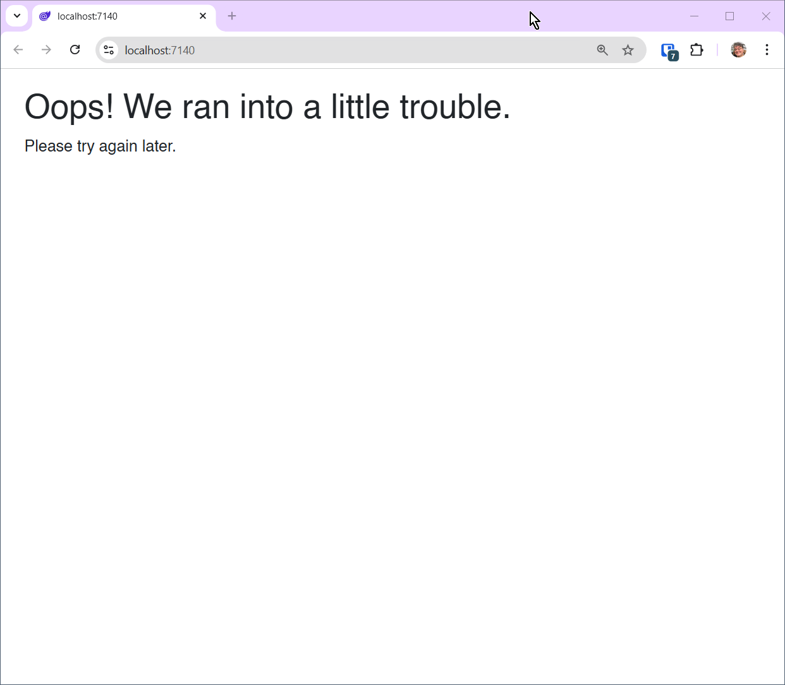

# Blazor Puzzle #65

## Exception Impossible!

YouTube Video: https://youtu.be/

Blazor Puzzle Home Page: https://blazorpuzzle.com

### The Challenge:

This is a .NET 9 Blazor Web App with Global Server Interactivity

We are purposely introducing a bug in *MainLayout.razor* to present a challenge:

```c#
@code
{
    protected override void OnInitialized()
    {
        int zero = 0;
        var result = 1 / zero;
    }
}
```

When you run the app, it will crash:



The exception will not be caught by the UI error handler.

Without using a try/catch, how can you gracefully tell the user that there was an error?

### The Solution:

The solution is to wrap the `<Router>` in *Routes.razor* in an `ErrorBoundary` like so:

```xml
<ErrorBoundary>
    <ChildContent>
        <Router AppAssembly="typeof(Program).Assembly">
            <Found Context="routeData">
                <RouteView RouteData="routeData" DefaultLayout="typeof(Layout.MainLayout)" />
                <FocusOnNavigate RouteData="routeData" Selector="h1" />
            </Found>
        </Router>
    </ChildContent>
    <ErrorContent>
        <div class="page">
            <div class="content px-4">
                <h1>Oops! We ran into a little trouble.</h1>
                <p>Please try again later.</p>
            </div>
        </div>
    </ErrorContent>
</ErrorBoundary>
```

This is a good strategy if you want to use your own components for reliably catching, logging, and displaying UI for unhandled exceptions.



For more information see the documentation at https://learn.microsoft.com/en-us/aspnet/core/blazor/fundamentals/handle-errors?view=aspnetcore-9.0#error-boundaries

Boom!
